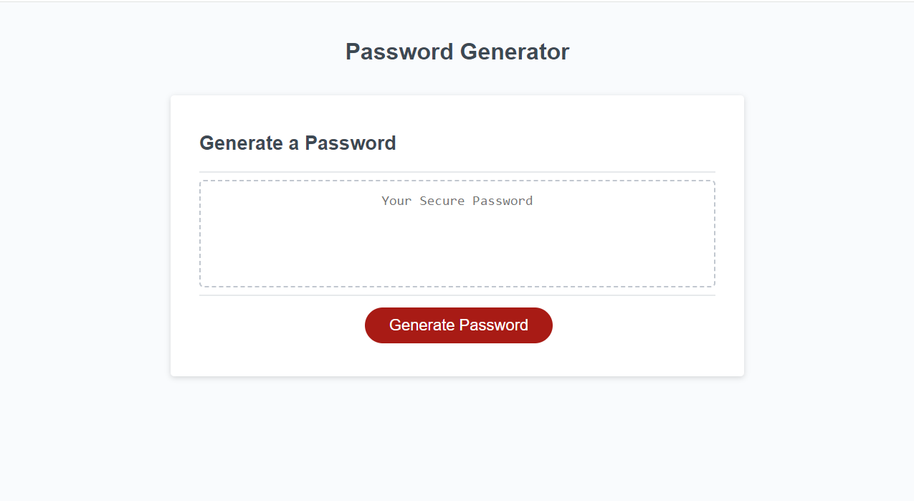

# Password-Generator

## Description
The aim of this project is creating code for random password generator using **JavaScript**. 

By maintaining this deployed webpage, I aim to present a comprehensive overview of my work and make it easy for others to connect with me.

## Installation
N/A

## Usage
A dataset is composed of 4 **arrays**: 
- special characters,
- numeric characters,
- lower cased characters,
- upper cased characters.

I am using series of **prompts** to collect user's input.

Using **JavaScript** I analyze user's input to create a random password. The code validates for each input if the below requirements are met:
- The password length chose by user is at least 8 characters but no more than 128,
- User chose at least one of 4 options regarding characters types that will be used to create password,
- At least one character is selected from each characters type array chosen by user.

Once all prompts are answered, the password is generated and written to the page.

The password is generated after each button click.

After opening the code in the browser the resulting analysis looks as following:

The [URL](https://paulinasiwko.github.io/Password-Generator/) of deployed application.

## Credits
A shuffle function to create the **final password** was copied from [Stack Overflow](https://stackoverflow.com/questions/2450954/how-to-randomize-shuffle-a-javascript-array)

## Licence 
N/A